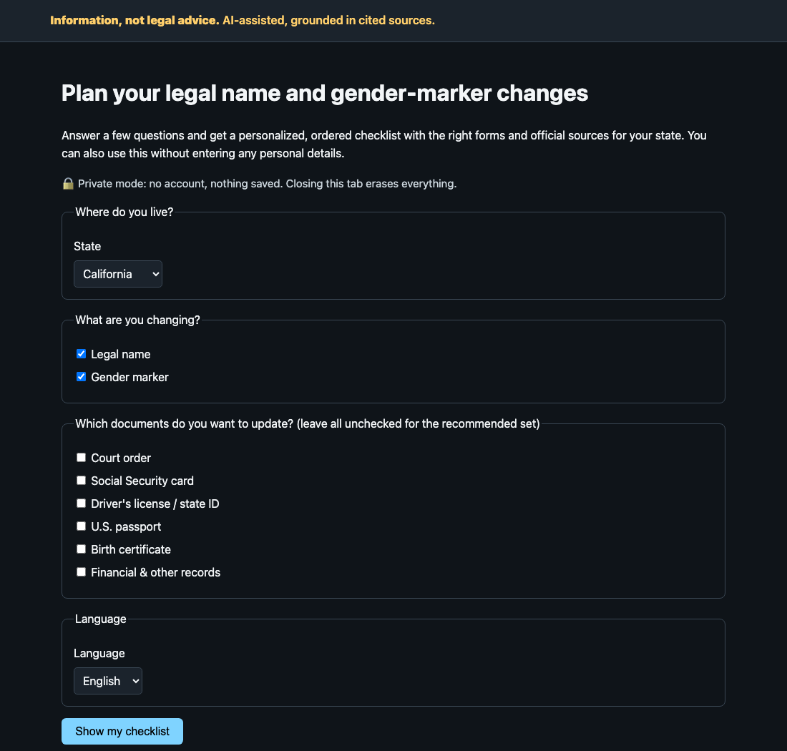
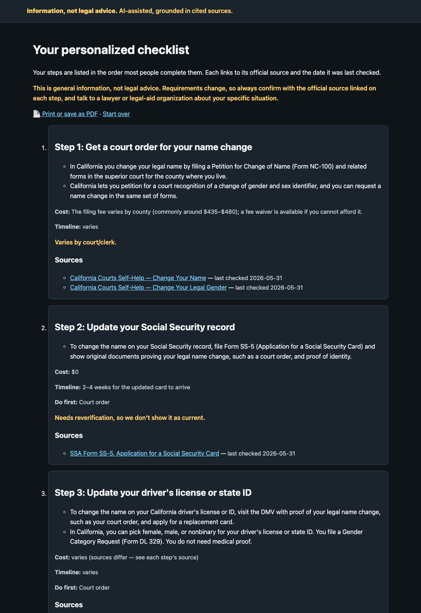
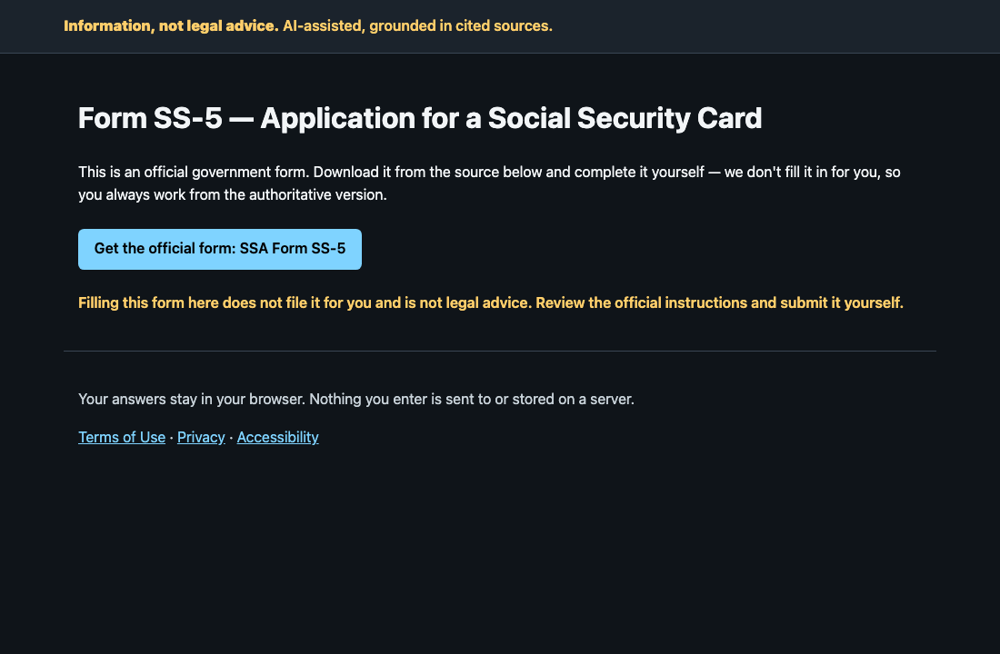

# Trans Docs Navigator

**A state-by-state navigator for legal name and gender-marker changes.** It turns the bureaucratic maze (vital records, courts, DMV, SSA, passport) into a personalized, ordered checklist, links the exact official form for each step, and explains everything in plain language with a citation and a last-checked date. Information, never legal advice. Built privacy-first, for users who may be in hostile jurisdictions.

## Quickstart

```sh
npm install        # install the pinned development and test tooling
make verify        # the full 24-gate pipeline (CI parity)
make dev           # http://localhost:8080 → intake → checklist → official form links
make eval          # regenerates docs/audits/eval-report.{md,json}
```

Requires Node ≥ 22.6 (TypeScript runs via native type-stripping; no build step). The server is plain `node:http`; the current reference build has zero production package dependencies.

Operations runbook: [`docs/OPERATIONS.md`](./docs/OPERATIONS.md). Build log and status: [`docs/STATUS.md`](./docs/STATUS.md). Audit artifacts (DPIA, eval reports, accessibility audit, residual-risk register) live in [`docs/audits/`](./docs/audits/).

## Project status

**Status:** in build (M6). Five states (CA, IL, NY, TX, WA) plus federal, in English and Spanish. All 24 automated merge gates pass (`make verify`): gate-count (self-description drift), lint, typecheck, tests with coverage, security scan, content validation, forms, citation coverage, source fidelity, privacy, freshness, disclosure, readability, i18n (UTF-8, BCP-47, EN/ES key parity, logical-CSS, pseudolocale overflow), accessibility, SEO, eval, an in-process p95-latency guard, SLO-definition/burn-alert validation, and a machine-derived launch-gate status check. CI additionally runs a real-browser accessibility gate, Lighthouse CI, Semgrep/CodeQL SAST, gitleaks + scheduled TruffleHog secret scanning, a container CVE scan, and zizmor over the workflows themselves. The remaining launch gates need human judgment, not code. Their status is **derived from the repository's artifacts on every `make verify` run** (`make launch-gates`), not written by hand — see the table below; keeping them open is a decision, not a gap.

**Supported versions:** `main` only — there are no maintained release lines yet (see [`SECURITY.md`](./SECURITY.md) for the vulnerability-reporting process and current pre-1.0 scope).

## Launch readiness (machine-derived)

<!-- launch-gates:start — GENERATED by scripts/launch-gates.ts. Do not hand-edit. -->

**Launch readiness: 8 of 8 review gates are OPEN.** Every status below is derived from the
repository's own artifacts on each `make verify` run — none of it is hand-written, and none of it
can be cleared by editing this table. **No record in this corpus has been verified by a named human.**

| Launch gate | Status | Machine-derived evidence | Derived from |
|---|---|---|---|
| Named-human verification of every record | 🔴 **OPEN** | **0 of 93** records verified by a named human. 93 carry the `Pilot Seed Reviewer` placeholder. | `corpus/` + `forms/registry.json` × `corpus/VERIFIERS.json` |
| Every record's claims backed by its own cited source | 🔴 **OPEN** | 152 assertion(s) located in their cited source, 0 unsupported (merge-blocking), **32 UNCHECKABLE**. Separately, **255 of 322 prose sentences carry no checkable literal** and no gate vouches for them. | `make fidelity` (`scripts/source-fidelity.ts`) |
| Every cited source actually under drift watch | 🔴 **OPEN** | **3** cited source(s) are UNWATCHABLE — no baseline can be taken or compared, so drift there is undetectable and `last_verified` is a human's assertion rather than a checked fact: `https://www.health.ny.gov/vital_records/gender_designation_corrections.htm` (403 to our declared user-agent; we do not spoof one), `https://www.nycourts.gov/courthelp/Family/nameChange.shtml` (403 to our declared user-agent; we do not spoof one), `https://www.ssa.gov/forms/ss-5.pdf` (no reviewed drift baseline) | `api/watchability.ts` over `corpus/source-hashes.json` + `forms/form-hashes.json` + `corpus/snapshots/index.json` |
| Independently authored expert gold set | 🔴 **OPEN** | `independent_author: false` — the gold set was co-authored with the corpus, so accuracy is partly tautological | `eval/gold.provenance.json` |
| Counsel review of the disclaimers (UPL) | 🔴 **OPEN** | no sign-off in `docs/signoffs/` — this gate cannot be cleared by editing a doc | docs/signoffs/*.json (gate: `counsel-review`) |
| Manual screen-reader / keyboard / 200%-zoom walkthrough | 🔴 **OPEN** | no sign-off in `docs/signoffs/` — this gate cannot be cleared by editing a doc | docs/signoffs/*.json (gate: `accessibility-walkthrough`) |
| Real Bedrock-backed eval run | 🔴 **OPEN** | no sign-off in `docs/signoffs/` — this gate cannot be cleared by editing a doc | docs/signoffs/*.json (gate: `bedrock-eval`) |
| DPIA + STRIDE threat-model sign-off | 🔴 **OPEN** | no sign-off in `docs/signoffs/` — this gate cannot be cleared by editing a doc | docs/signoffs/*.json (gate: `dpia`) |

<!-- launch-gates:end -->

## Why it matters

The rules for changing your name and gender marker differ by state and by document, they change often, and the guidance that exists is scattered across PDFs, court clerks, and forum lore. People pay for incomplete help or give up. A current, cited, accessible navigator is a public good. And correctness here is a safety property: wrong guidance costs people money, time, and sometimes safety.

## What it looks like

| Intake | Checklist | Official form, linked |
|---|---|---|
|  |  |  |

## Live preview

**▶ [Live demo](https://7cddozrk6sfpsq7foszis7tcza0boyka.lambda-url.us-west-2.on.aws/)** — runs the real app (every route works, not a static export) on AWS Lambda. It serves machine-compiled seed records, **none yet verified by a named human** — the interface says so beside every source, and the table below tracks the count. It's a serverless, scale-to-zero deploy chosen as a cost guardrail: no always-on compute, a per-month budget alarm, no paid LLM calls by default. First request after idle takes a few seconds to wake. (AWS setup and cost-guardrail breakdown: [`docs/DEPLOY-AWS-PREVIEW.md`](./docs/DEPLOY-AWS-PREVIEW.md).)

Prefer your own host? One click deploys the same image to Render's free tier:
[](https://render.com/deploy?repo=https://github.com/ChelseaKR/trans-docs-navigator) — see [`docs/DEPLOY-PREVIEW.md`](./docs/DEPLOY-PREVIEW.md).

It's a demonstration, not a launched service: the corpus is illustrative seed content with corrected official sources but placeholder verifiers, and every page carries the "information, not legal advice" disclosure. It also runs locally in one command (see Quickstart).

## What it does

- Asks a short, respectful intake: your state, which documents, your language. There is no account. Private mode skips the optional local resume copy; the server still processes the request fields needed to render the page, as the Privacy Notice explains.
- Produces an **ordered, personalized checklist** (court order → SSA → DMV → passport → records), with prerequisites, realistic costs, and timelines.
- Plans a **move to another state** (`/move`): a destination delta over the same cited corpus. Given an origin, a destination, and the documents you already hold, it says what carries over, what the new state re-issues on its own terms, in what order — and which routes close the day you stop being a resident of the state you're leaving (Texas's petition is filed "in the county where you live"; that door shuts when you move). Cost is the #1 reported barrier to relocation, so the cost model is a floor built only from fees the sources actually state, explicit about every step it cannot price, and it surfaces fee waivers. It never guesses, and it never claims the new state honours a document the old one issued — no source says so. See [`docs/RELOCATION.md`](./docs/RELOCATION.md).
- **Links the exact official form** for each step, at its government source, for you to download and file yourself. (It does not auto-fill: these are XFA/LiveCycle PDFs that browser tooling can't fill, and a mis-filled legal form is a real harm — better the authoritative form.)
- Answers questions with **inline citations** to the governing source and a last-verified date, and says plainly when it doesn't know.

## Design guarantees

Four properties are enforced by merge-blocking CI gates, not by convention:

1. **No claim without a citation — and no citation without a matching source.** Every substantive statement renders with a source and a last-verified date, or it does not render. This applies to model-generated text too: output passes through the same post-generation enforcement, so a hallucinated sentence cannot reach a user. That was only half the chain, though: it proved an answer cited a *record*, never that the record matched the *source it cites*. A record could assert a fee, a form, or a deadline its own cited page never stated and every gate stayed green — which is exactly how the corpus came to name a retired DMV form and a $0 fee that page never mentioned, with an unchanged source hash, so the drift watcher saw nothing either. `make fidelity` closes that: it re-reads every record against a committed offline snapshot of its cited source and blocks any load-bearing claim — fee, timeline, form id, hard requirement — that isn't locatable there. It is also honest about its limits: it does not attempt semantic entailment, so what it cannot vouch for is **counted and published** in [`docs/audits/source-fidelity.md`](./docs/audits/source-fidelity.md) rather than passed in silence.
2. **Information, not legal advice.** Every page carries the disclosure, persistently and in both languages. The service makes no representations about individual legal outcomes.
3. **Privacy is a safety property.** The service has no account or identity-profile database, and the form helper keeps names on-device. Checklist selections and an optional question are sent in the request URL so the server can render a response. Raw question text bypasses the application cache and is excluded from application logs and responses; selection-only renders may use a bounded in-memory cache, and allowlisted request metadata is retained for a limited period. The optional save-progress blob is encrypted with a passphrase and remains on the user's device. In a hostile-jurisdiction threat model, this is deliberate minimization—not a claim that no server, browser-history, or infrastructure record can exist.
4. **Stale law is broken law.** Every record has a freshness SLA. Expired data is shown as "needs reverification," never silently served as current.

The privacy controls are checked three ways: a static gate rejects direct identity-field handling in runtime API and log-call code, the application logger drops fields outside a fixed allowlist, and a data-flow test injects sentinel content into every request field and proves it is not reflected into an application log descriptor or response body. Those checks do not claim that request inputs never reach the server; the exact request, cache, log, and provider boundaries are documented in the [Privacy Notice](https://7cddozrk6sfpsq7foszis7tcza0boyka.lambda-url.us-west-2.on.aws/privacy) and [`docs/audits/dpia.md`](./docs/audits/dpia.md).

## Architecture in one paragraph

Retrieval-mandatory generation over a hand-verified corpus of jurisdiction records. The HTTP layer (`api/server.ts`) does plumbing only; routing and validation live in unit-tested `api/router.ts`; the checklist engine, retrieval, and citation enforcement are separate modules under `api/`. Rendering is server-side, accessible HTML (`src/`) that works with JavaScript disabled; progress tracking and save/resume progressively enhance. All user-facing strings live in per-language bundles under `src/i18n/`; adding a language means writing one bundle module and registering it. A deterministic extractive composer is the default generator; a Bedrock-backed generator is the production seam, subject to identical citation enforcement.

## Internationalization

English and Spanish ship with full parity, enforced twice: the compiler checks every locale bundle against the same interface, and an end-to-end test suite asserts no English chrome leaks into Spanish pages. Where Spanish coverage is thinner than English for a state, the page says so honestly instead of pretending.

## Standards conformance

This repo references the portfolio's private engineering standards (`/STANDARDS`)
rather than restating them; they are fetched read-only at CI time
(`.github/workflows/standards.yml`, pinned to `.standards-version`), never committed.
Per-repo *values* live in [`docs/ROADMAP.md`](docs/ROADMAP.md) §7/"Observability" and
[`docs/RESPONSIBLE-TECH-AUDITS.md`](docs/RESPONSIBLE-TECH-AUDITS.md). All 11 standards
apply to this repo — none is N/A. **No row below claims more than is actually gated**;
where a gap is open, it says so and points at where it's tracked.

| Standard | Applies | This repo's posture |
|---|---|---|
| Quality & Metrics | ✅ | `make verify` (24 stages) = CI parity; in-process p95-latency and SLO-definition/burn-alert checks are merge-blocking. [`DEFINITION_OF_DONE.md`](DEFINITION_OF_DONE.md) defines done with an honest gate/review/human-gate split; the PR template carries its rollback/observability/ISO-25010 lines. ⚠️ Open: no DORA ledger. |
| Code Quality | ✅ | TS 6 + `tsc --strict` plus all 7 beyond-strict flags (`noUncheckedIndexedAccess`, `noImplicitOverride`, `noFallthroughCasesInSwitch`, `noImplicitReturns`, `noUnusedLocals`, `noUnusedParameters`, `exactOptionalPropertyTypes`); coverage ≥90%/85%/90% (lines/branches/functions) enforced via `node --test --test-coverage-lines=90 --test-coverage-branches=85 --test-coverage-functions=90` (`scripts/run-tests.ts`), merge-blocking — the TS-native equivalent of CQ's coverage-floor gate, exceeding the ≥80% target in `CODE-QUALITY-STANDARD.md` §3. Python controls **N/A — reason: zero Python source in this repo** (`CODE-QUALITY-STANDARD.md` §11): `coverage_threshold_set` (CQ-08) and `single_pyproject` (CQ-25) as named by `automation/conformance_check.py` are Python-specific (they check for `pyproject.toml`/`cov-fail-under`) and will always read MISSING here — that checker's `is_python` heuristic is triggered by the mere presence of a `tests/` directory, which §4 of the same standard *requires* for TS repos too, so the false positive is structural, not a gap in this repo. Adding a `pyproject.toml` with a fabricated Python coverage floor to satisfy the string-match would be gaming the check, not fixing anything real; the enforced control this repo actually needs (a coverage floor, single root config) is the row you're reading. Single-config-source: one each of `package.json`, `tsconfig.json`, `stylelint.config.js`, `playwright.config.ts` at repo root, no duplicates/nesting — no `eslint.config.mjs`/`vitest.config.ts` since this repo uses neither ESLint nor Vitest (see below), matching the TS half of CQ-25's project-layout rule (§4). Bundler/React controls N/A (zero runtime deps, no build step, no JSX). No ESLint/Prettier — a deliberate dependency-minimal deviation, recorded with its compensating controls in [`docs/adr/0006`](docs/adr/0006-no-eslint-no-prettier-no-bundler.md); the five build ADRs are migrated to individual files ([`docs/adr/0001`–`0005`](docs/adr/)). ⚠️ Open: `scripts/lint.ts` covers `api/`+`src/` only — extending it over `scripts/`/`tests/`/`eval/` (CQ-34/35) is tracked in ADR-0006's consequences. |
| Security & Supply-Chain | ✅ | ASVS **L2** posture; Semgrep + CodeQL + Trivy (container) all blocking; gitleaks CI (diff/push) + scheduled TruffleHog full-history scan + pre-commit gitleaks hook; HSTS + Permissions-Policy headers; SHA-pinned actions (Renovate, 72h cooldown); Harden-Runner (`audit` mode) on `ci.yml`/`release.yml`. ⚠️ Open: Harden-Runner not yet flipped to `block` with an allowlist; OpenSSF Scorecard aggregate is 5.8/10 as of the last dated run (`docs/audits/scorecard-2026-07.md`) — real, tracked, not hidden. |
| CI/CD | ✅ | `make verify` byte-for-byte in CI; least-privilege job-scoped tokens; concurrency groups on every publish/deploy job; zizmor + CodeQL `language: actions` cover the workflow YAML itself; `.github/CODEOWNERS` present. ⚠️ Open: the branch-protection required-checks list needs a manual update to include the two newest jobs — see `docs/audits/branch-protection-2026-07-05.md` for the exact settings and what's missing (this is a repo-settings change, not something a code change can do). |
| Release & Versioning | ✅ | `release.yml` re-runs the full `make verify` gate set at the tagged commit, checks tag↔`package.json` version consistency, publishes to GHCR **by immutable digest only (never `:latest`)**, keyless-signs with cosign, attests a schema-validated CycloneDX SBOM and SLSA provenance, and independently pulls the published artifact back down to verify it before the release is considered done. `CHANGELOG.md` (Keep a Changelog) added. ⚠️ Open: no tag has ever been pushed, so this pipeline is correct-on-paper but untested in anger; no `/version` endpoint yet. |
| Accessibility | ✅ | WCAG 2.2 AA. Real-browser pa11y-ci (axe + HTML_CodeSniffer, 0 violations, 15 URLs incl. the offline-shell page) + Lighthouse CI (a11y ≥0.95, perf ≥0.90, LCP/CLS/TBT budgets) both blocking; mechanical static gate covers 19 page templates. ⚠️ Open: the manual screen-reader/keyboard/200%-zoom walkthrough is still PENDING sign-off (`docs/audits/accessibility-2026-05-31.md`, dated, explicitly flagged as now covering a wider surface than when it was written — not silently treated as current); no ACR/VPAT yet. |
| Observability | ✅ — **Tier A** (hosted service) | Declared under `## Observability` in `docs/ROADMAP.md`. The repo ships allowlist structured logs, `/livez` + fail-closed `/readyz`, W3C-correlated server/Bedrock spans, bounded-route RED metrics at `/metrics`, and parsed 30-day availability/latency SLOs with fast/slow burn alerts. Lighthouse CI covers Tier-B lab budgets. RUM is **N/A — reason: no client telemetry is sent to a third-party analytics vendor**. ⚠️ Open: production collector/export wiring, alert-rule loading/delivery, and a recurring real-Bedrock eval require deployment credentials. |
| Internationalization | ✅ — in scope, declared in [`docs/I18N.md`](docs/I18N.md) | EN/ES ship with compiler-enforced key parity, an end-to-end no-leakage test suite, UTF-8 (G1) + BCP-47 (G3) + pseudolocale-overflow (G9) + logical-CSS (G10) gates, and disaggregated eval parity (≤5pp). `Content-Language` is now set on every rendered response. |
| AI Evaluation | ✅ | Retrieval-mandatory generation; **no claim renders without a citation**, enforced identically for the deterministic composer and the Bedrock seam (`api/citation.ts`). Groundedness, accuracy, refusal, adversarial behavior, retrieval recall@8, precision@1, and segment parity are merge-blocking. ⚠️ Open: the gold set is machine-flagged co-authored, so accuracy is not yet independent; a real-Bedrock run remains a credentialed launch gate. |
| Documentation | ✅ | `CITATION.cff`, `SECURITY.md` (private vuln reporting), `CHANGELOG.md`, `.standards-version`, currency stamps on every audit artifact, and this table. ADRs live in [`docs/adr/`](docs/adr/) (0000 practice record; 0001–0005 migrated from `docs/ROADMAP.md` §6; 0006 toolchain deviation). |
| Responsible-Tech Framework | ✅ — in full (sensitive population) | `docs/RESPONSIBLE-TECH-AUDITS.md` instantiates §A–F; request-content non-reflection test, allowlist logger, disclosure gate, and corpus quarantine are all portfolio-reference quality. ⚠️ Open: counsel/DPIA sign-off and the accessibility walkthrough remain review-gated — see `docs/audits/dpia.md` and `docs/audits/accessibility-2026-05-31.md`; AI risk register / impact assessment / EU AI Act classification drafted 2026-07-17 (`docs/audits/ai-risk-register.md`, `ai-impact-assessment.md`, `eu-ai-act-classification.md`) — all three unreviewed drafts, counsel/human finalization pending. |

No standard above is a bare, unexplained gap: every ⚠️ names the tracking artifact. This
table itself was added 2026-07-05 (it did not exist before, which was itself a defect
per `STANDARDS/README.md`'s "silent omission" rule).

## Contributing and conduct

See [`CONTRIBUTING.md`](./CONTRIBUTING.md) and [`CODE_OF_CONDUCT.md`](./CODE_OF_CONDUCT.md). Accessibility barriers are treated as bugs.

## Provenance

This project was built AI-assisted (the disclosure on every page says so too) within a portfolio that shares a common quality standard: every project ships with merge-blocking gates for its core safety properties, and audit artifacts are committed to the repo rather than claimed. Related scaffolding (a civic-RAG starter and an eval harness) lives in separate repos of the same portfolio.

## License

[AGPL-3.0-or-later](./LICENSE).
